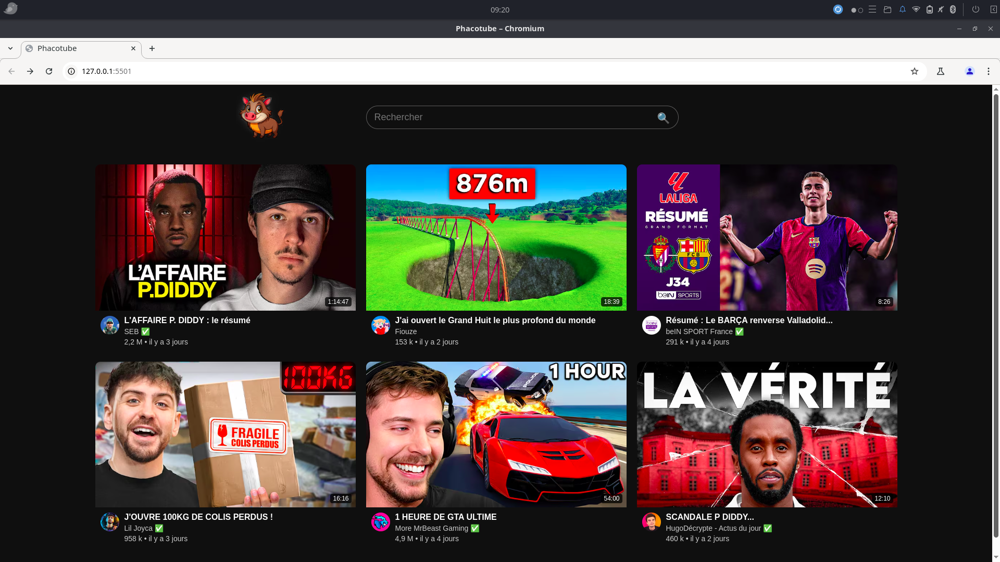

# Projet Youtube Version 1.0

Projet de formation : Petite page Youtube
dans le cadre de ma formation, j'ai eu à faire une petite page d'accueil dans le style de YouTube pour mettre nos connaissances en pratique,
injecter du code HTML à partir de JavaScript avec des "function", et pouvoir faire des recherches  

  Les fonctionnalités de base comme :

  -Posibilité de faire des recherches par titre,

  -Posibilité de faire des recherches par nom de chaine.
 

  

Ouvrir en premier le fichier index.html

## 🛠️Compérences :

## 🔗Liens :

